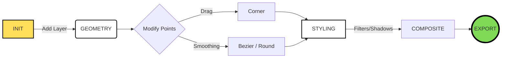

<div align="center">

<svg width="100%" height="180" viewBox="0 0 800 180" xmlns="http://www.w3.org/2000/svg">
  <defs>
    <pattern id="grid" width="20" height="20" patternUnits="userSpaceOnUse">
      <path d="M 20 0 L 0 0 0 20" fill="none" stroke="#e5e7eb" stroke-width="1"/>
    </pattern>
    <filter id="shadow">
      <feDropShadow dx="5" dy="5" stdDeviation="0" flood-color="black" />
    </filter>
  </defs>
  <rect width="100%" height="100%" fill="white"/>
  <rect width="100%" height="100%" fill="url(#grid)"/>
  
  <rect x="150" y="40" width="500" height="100" fill="#FFDE59" stroke="black" stroke-width="4" filter="url(#shadow)"/>
  <text x="400" y="105" font-family="monospace" font-size="40" font-weight="900" text-anchor="middle" fill="black">CSS SHAPE GEN_PRO</text>
  
  <circle cx="150" cy="40" r="10" fill="#FF66C4" stroke="black" stroke-width="2"/>
  <circle cx="650" cy="140" r="15" fill="#5CE1E6" stroke="black" stroke-width="2"/>
</svg>
<p>
  <a href="https://github.com/yourusername/repo/stargazers">
    
  </a>
  <a href="https://github.com/yourusername/repo/forks">
    
  </a>
  <a href="https://opensource.org/licenses/MIT">
    
  </a>
  
</p>

<h3>STOP FIGHTING WITH CLIP-PATH. START CREATING ART.</h3>

<p align="center">
  A brutalist, layer-based vector editor for the web. <br>
  <b>Zero Login. Zero Bloat. Pure Math.</b>
</p>

</div>

---

### 🖥️ THE INTERFACE

<div align="center">
  
</div>

<br>

### ⚡ FEATURES MATRIX

| **🎛️ THE EDITOR** | **🎨 STYLING ENGINE** | **💾 EXPORT OPS** |
| :--- | :--- | :--- |
| **Multi-Layer System**<br>Stack unlimited shapes. Reorder, toggle visibility, and mix layers. | **Image Masks**<br>Upload photos. Pan, Zoom, Blur, and Rotate images inside any polygon. | **Tailwind Ready**<br>Generates arbitrary values automatically: `clip-[polygon(...)]`. |
| **Smart Generators**<br>Instant Polygons, Stars (w/ inset control), and organic Blobs. | **Neo-Effects**<br>Hard Drop Shadows, Inner Shadows, and SVG Noise/Sketchy Filters. | **Framework Agnostic**<br>Copy raw CSS, pure SVG code, or React Component snippets. |
| **Precision Tools**<br>Grid Snapping (5%), Symmetry Mode (X/Y), and Keyboard nudging. | **Mix-Blend-Modes**<br>Multiply, Screen, Overlay support for complex compositions. | **Raster Export**<br>Download high-res PNGs or stand-alone SVG files instantly. |

---

### 🧬 HOW IT WORKS (FLOW)



---

### 🛠️ TECH STACK

We keep it raw and dependency-light.

<p align="left">
  
  
  
  
</p>

> **Note:** The entire editor logic is contained within `index.html` using vanilla JS state management.

---

### 🎨 DESIGN SYSTEM

The UI follows a strict **Neo-Brutalist** token system found in `tailwind.config`.

| COLOR | HEX | USAGE |
| :--- | :--- | :--- |
| <span style="display:inline-block;width:20px;height:20px;background-color:#000000;border:1px solid #ccc;"></span> | `#000000` | Borders & Text |
| <span style="display:inline-block;width:20px;height:20px;background-color:#ffffff;border:1px solid #ccc;"></span> | `#ffffff` | Canvas Background |
| <span style="display:inline-block;width:20px;height:20px;background-color:#FFDE59;border:1px solid #ccc;"></span> | `#FFDE59` | **Neo-Yellow** (Primary) |
| <span style="display:inline-block;width:20px;height:20px;background-color:#FF66C4;border:1px solid #ccc;"></span> | `#FF66C4` | **Neo-Pink** (Accents) |
| <span style="display:inline-block;width:20px;height:20px;background-color:#7ED957;border:1px solid #ccc;"></span> | `#7ED957` | **Neo-Green** (Success) |
| <span style="display:inline-block;width:20px;height:20px;background-color:#5CE1E6;border:1px solid #ccc;"></span> | `#5CE1E6` | **Neo-Blue** (Info) |

---

### 🚀 QUICK START

No build steps. No `npm install`. Just raw web power.

```bash
# 1. Clone the repository
git clone [https://github.com/yourusername/CSS-Shape-Generator-Pro.git](https://github.com/yourusername/CSS-Shape-Generator-Pro.git)

# 2. Navigate to directory
cd CSS-Shape-Generator-Pro

# 3. Launch
# Open index.html in Chrome/Firefox/Edge.
# (Optional) Use Live Server for better experience.
```

---

```text
______________________________________________________________________
|                                                                    |
|  MADE WITH 🖤 BY BISMAY                                            |
|  COPYRIGHT 2026. ALL RIGHTS RESERVED.                              |
|____________________________________________________________________|
       \   ^__^
        \  (oo)\_______
           (__)\       )\/\
               ||----w |
               ||     ||
```
